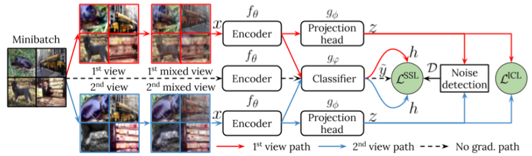

# Multi-Objective Interpolation Training for Robustness to Label Noise

Joint interpolated supervised contrastive learning and interpolated semi-supervised learning for robustness to label noise. We achieve state-of-the-art results in CIFAR-10, CIFAR-100, Mini-ImageNet and Mini-WebVision!

Important note: Our method is robust in all scenarios with a single parametrization. We only modify typical training parameters (epochs, learning rate scheduling, batch size or memory size).

Multi-Objective Interpolation Training (MOIT) for improved robustness to label noise. We interpolate samples and impose the same interpolation in the supervised contrastive learning loss (ICL) and the semi-supervised classification loss (SSL) that we jointly use during training. Label noise detection is performed at every epoch and its result is used after training MOIT to fine-tune the encoder and classifier to further boost performance with MOIT+.

### Running the code:
We provide all code used to simulate label noise with symmetric and asymmetric distributions and provide example scripts to run our approach with both noises.

To run the code use the provided scripts in cifar10 and cifar100 folders. Datasets are downloaded automatically when setting "--download True". The dataset has to be placed in data folder (should be done automatically).

### Requirements:
* Python 3.7.7
* Pytorch 1.0.1 (torchvision 0.2.2)
* Numpy 1.18.4
* scikit-learn 0.23.2
* cudatoolkit 9.0
* cudnn 7.6.5

Note: Our implementation uses parts of "Supervised Contrastive Learning" https://github.com/HobbitLong/SupContrast and on Cross-Batch Memory Embedding Learning https://github.com/MalongTech/research-xbm.

